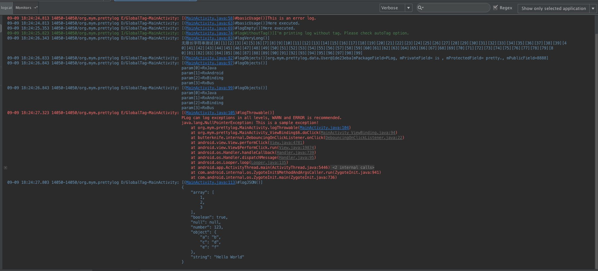

[  ](https://android-arsenal.com/details/1/4884)

#Android-PLog  [](https://travis-ci.org/Muyangmin/Android-PLog)[  ](https://bintray.com/muyangmin/org.mym/Android-PLog/_latestVersion)](https://img.shields.io/badge/Methods and size-200 | 21 KB-e91e63.svg)


[English Version](README_EN.md)

## PLog 2.0 beta2已经发布，欢迎试用！

## Summary / Features
PLog是一个Android专用的日志封装库，具备以下特性：
#### 容易打印
* **支持无Tag打印**
* **支持空消息打印（通常用于观察某处是否执行）**
* **支持任意参数类型**
* **支持变长参数和自动格式化**
* **支持Builder方式打印**

#### 输出可控
* **支持多维度的输出拦截**
* **支持自定义输出装饰样式**
* **支持多通道同时输出**
* **支持自动换行（SoftWrap）**

#### 筛选容易
* **支持全局Tag**(可以区分不同应用)
* **支持自动Tag**(可以区分不同类名)
* **支持保留堆栈**(可以区分不同文件和方法，并且实现在AS中**自动日志定位**)
* **支持分组打印**(可以区分不同开发者, etc)

#### 按需依赖
核心功能模块和定制特性完全分离，体积轻巧，并且全部支持Jcenter依赖。

#### 扩展灵活
核心功能全部接口化，通过简单的设置和接口注入就可以完成绝大部分日志需求。

## Compare With Other Libs
| Library Name | [Logger](https://github.com/orhanobut/logger) | [Timber](https://github.com/JakeWharton/timber) | [KLog](https://github.com/ZhaoKaiQiang/KLog) | [Android-PLog](https://github.com/Muyangmin/Android-PLog)
| ------| ------ | ------ | ------ | ----- |
| Star/Fork | 5.7K+/1.0K+ | 3.5K+/366 | 1.1K+/251 | **Welcome!**|
| 容易打印 | √ | √ | √ | √ |
| 上手简单 | √ | √ | √ | √ |
| 设置灵活 | ☆ | ☆ | ☆ | ☆ |
| 体积轻巧 | ☆ | ☆☆ | ☆ | ☆☆ |
| 支持定位 | √ | × | √ | √ |
| 线程信息 | √ | × | × | √ |
| 筛选容易 | ☆ | ×  | ☆ | ☆☆ |
| 日志美观 | ☆ | × | ☆ | ☆☆ |
| 输出可控 | × | ☆☆ | ☆ | ☆☆ |

> 关于表格内各个比较维度的解释，请参见：[我为什么要写PLog](https://github.com/Muyangmin/Android-PLog/wiki/WhyUsePLog)。

## Usage
请参考Wiki：[Basic Usage](https://github.com/Muyangmin/Android-PLog/wiki)

## Sample Screen Shot


## Contribution & Contact
如果您在使用这个库的时候遇到困难，或者有任何的反馈、建议，都可以通过GitHub Issue 功能或下面的邮箱联系我：
**<muyangmin@foxmail.com>**

## Licence 
```
Copyright 2016-2017 Muyangmin

Licensed under the Apache License, Version 2.0 (the "License");
you may not use this file except in compliance with the License.
You may obtain a copy of the License at

   http://www.apache.org/licenses/LICENSE-2.0

Unless required by applicable law or agreed to in writing, software
distributed under the License is distributed on an "AS IS" BASIS,
WITHOUT WARRANTIES OR CONDITIONS OF ANY KIND, either express or implied.
See the License for the specific language governing permissions and
limitations under the License.
```
